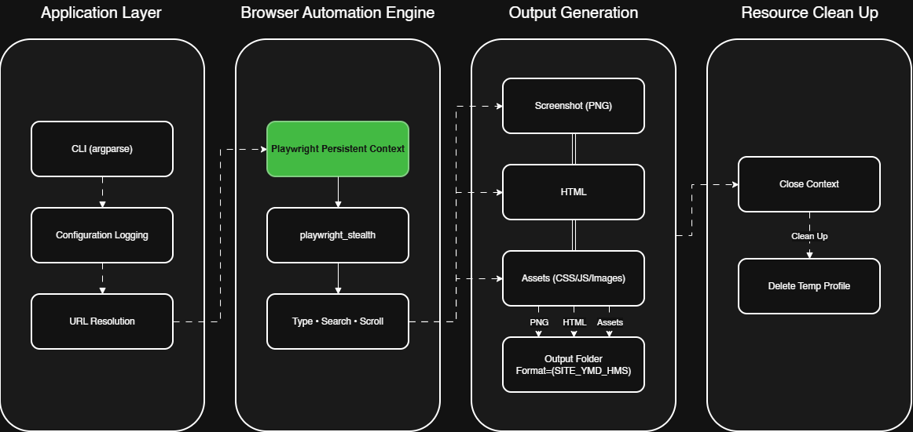

# Scraper
Opens a site in real Chrome (via Playwright, with stealth patches and
human-like typing/scrolling), then saves a screenshot, the HTML, and a
report on whether Cloudflare/Akamai were detected.



## Architecture

The application follows a modular architecture, where the execution is divided into four distinct layers. Each layer is responsible for a specific stage of the automation process, improving maintainability and separation of concerns.

- Application Layer: Initializes the application by parsing command-line arguments, loading configuration settings, setting up logging, and resolving the target URL.
- Browser Automation Engine: Launches a persistent Chromium browser using Playwright, applies stealth techniques to reduce common automation fingerprints, and performs browser interactions such as searching, typing, and scrolling.
- Output Generation: Collects data generated during execution, including full-page screenshots, HTML source code, and website assets (CSS, JavaScript, and images), and stores them in a timestamped output directory.
- Resource Clean Up: Gracefully closes the browser context and removes temporary browser profile data to ensure proper resource management after execution.

## Install

```bash
git clone https://github.com/SushilDixith/scraper.git
cd scraper
pip install playwright playwright-stealth
playwright install chrome
```

Run as a regular (non-root) user — root forces `--no-sandbox`, which is
itself a detectable flag.

## Usage

```bash
python site_scraper.py --url https://example.com
python site_scraper.py --url https://example.com --keyword "search term"
python site_scraper.py --url https://example.com --save-assets
```

No `--url`? You'll be prompted for one.

## Flags

| Flag | Does |
|---|---|
| `--url` | Site to open |
| `--keyword` | Search term to type and submit |
| `--selector` | CSS selector for the search box, if auto-detect fails |
| `--output-dir` | Where run folders go |
| `--save-assets` | Also save assets, page sections, and subpages |
| `--no-sections` | With `--save-assets`, skip section screenshots |
| `--no-subpages` | With `--save-assets`, skip subpage crawling |
| `--max-subpages N` | Cap on subpages crawled |
| `--headed` | Show the browser window |
| `--log-level` | DEBUG / INFO / WARNING / ERROR |

Defaults for anything not passed live in `config.py`.

## Output

```
output/<slug>_<timestamp>/
├── screenshot.png
├── page.html
├── cdn_report.txt
├── assets/       # --save-assets only
├── sections/     # --save-assets only
└── subpages/     # --save-assets only
    └── 01_<slug>/screenshot.png, page.html, sections/
```
## CDN Detection

`cdn_report.txt` checks three signals to flag Cloudflare or Akamai, and
notes which ones fired as evidence:

- **Response headers** — e.g. `cf-ray`, `cf-cache-status` for Cloudflare;
  `server: AkamaiGHost` or `akamai-*` / `x-akamai-*` headers for Akamai.
- **Cookies** — e.g. `cf_clearance`, `__cf_bm` for Cloudflare;
  `ak_bmsc`, `_abck`, `bm_sv` for Akamai.
- **Page content** — challenge or block-page text like "Just a moment...",
  "Checking your browser", or "Access Denied".

Any one signal is enough to flag a hit. This is a heuristic, not a
guarantee, a site can sit behind either CDN without tripping any of these
checks, and a false positive is possible if unrelated text happens to match.
